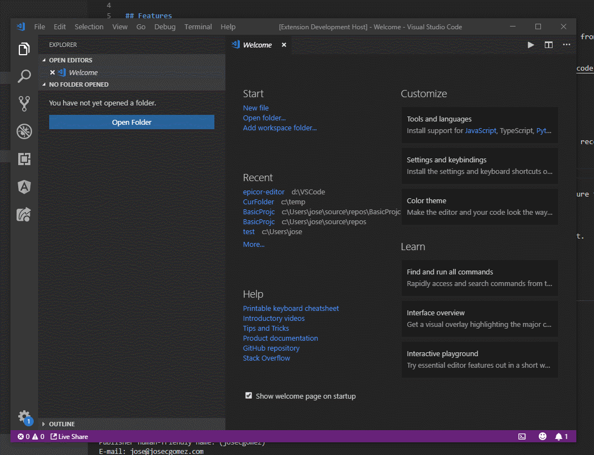

# epicor-editor README

This is an experimental Visual Studio Code Extension which allows you to Edit, Test and Debug Epicor Customizations right from VS Code

## Features

This is an experimental extension which will allow you to Edit, Test and Debug Epicor Customizations right from VS Code. It can be quite handy specially for the code auto complete feature that VS Code Provides.

Here is a few animations of the extension in Action

## Requirements

* You will need to have the [OmniSharp Extension] (https://marketplace.visualstudio.com/items?itemName=ms-vscode.csharp) Installed to get this benefit to so install that first.

* If you want to be able to debug using DNSpy you will have to download and install [DNSpy] (https://github.com/0xd4d/dnSpy/releases) and extract it into a folder of your choosing

* lease note you will have to download the helper library from the following links (based on your version of Epicor) and unzip it into your client folder

[10.2.300.X](https://josecgomez.com/files/CustomizationHelper.10.2.300.X.zip)

## Extension Settings

This extension contributes the following settings:

* `epicor.clientfolder`: Should point to the folder where your Epicor client is installed
* `epicor.customizationfolder`: Should point to a folder where you'd like all the customization projects downloaded / created in
* `epicor.dnspylocationr`: The folder in which you installed DNSpy 

## Known Issues

## Release Notes

### 0.0.9

Initial release 
